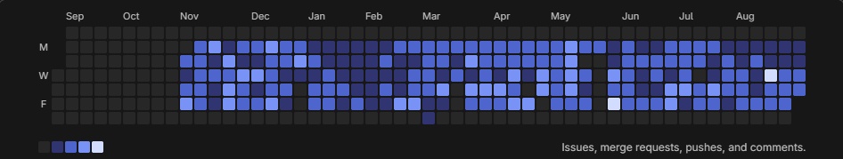

  

  <b>Frontend Developer • Web & Mobile • Istanbul, Turkey 🇹🇷</b>

  
  
  

---

## 👨‍💻 About Me

Frontend Developer with around **4 years of software development experience**, building scalable web and mobile applications with **Vue.js, React.js, Next.js, React Native and TypeScript**.

Currently working at **Intime Info**, mainly on enterprise HR, PDKS, CRM, contract, organization and reporting systems.

- 📍 Istanbul, Turkey
- 💻 Web & Mobile Development
- ⚡ Performance & Clean Architecture
- 🔗 REST API Integrations
- 🔀 Git / GitLab / Merge Request workflows
- 🧠 Interested in AI-powered applications

---

## 💼 Experience

### Intime Info
**Frontend Developer · 2025 — Present**

Enterprise applications including HR, PDKS, CRM, organization, contracts, leave management and reporting using Vue 3 and TypeScript.

### TruYemek
**Frontend & React Native Developer · 2024 — 2025**

Developed web, admin and mobile applications serving **10,000+ users and 100+ restaurants**, including CRM dashboards and secure payment systems.

### Alone Software
**Frontend Developer · 2024**

React, Vite and REST API based frontend development.

### Istanbul Metropolitan Municipality
**Frontend Developer · 2023**

React based frontend development and API integrations.

### Metro Istanbul
**Software Developer · 2021 — 2022**

ASP.NET MVC, C# and SQL based application development.

---

## 🛠 Tech Stack

  

### Frontend
`React` `Next.js` `Vue.js` `Nuxt.js` `React Native` `TypeScript` `JavaScript` `Tailwind CSS`

### State & Data
`Redux` `Zustand` `Pinia` `TanStack Query` `Axios`

### Backend
`Node.js` `Express.js` `NestJS` `ASP.NET MVC`

### Databases
`PostgreSQL` `MySQL` `MongoDB` `Redis` `SQL Server`

### Tools
`Git` `GitHub` `GitLab` `Docker` `Vercel` `AWS` `CI/CD`

---

## 📊 Development Activity

Most of my professional development activity happens in **private GitLab repositories**, so GitHub alone does not represent my full contribution history.

### 🦊 GitLab Contribution Activity

  

  Issues • Merge Requests • Pushes • Code Reviews • Comments

---

## 📈 GitHub Stats

  
  

---

## 🔥 GitHub Streak

  

---

## 📈 GitHub Activity Graph

  

---

## 🚀 Featured Projects

### 📱 Video Diary Mobile App
AI-powered diary application with mood detection and multilingual summaries.

`React Native` `Expo` `Zustand` `OpenAI API`

[View Repository](https://github.com/EgemenShn01/video-diary-mobile-app-Expo-React-Native)

### 🖥 Refine.dev Clone
Modern admin panel with CRUD operations and authentication.

`React` `TailwindCSS` `Refine`

[View Repository](https://github.com/EgemenShn01/refine.dev-CLONE)

### 📊 Kanban Board
Drag-and-drop task management application.

`JavaScript` `HTML` `CSS`

[View Repository](https://github.com/EgemenShn01/kanbanboard)

### 🚇 Istanbul Metro Line Information
Public transportation information application for Istanbul Metro lines.

`JavaScript` `REST API`

[View Repository](https://github.com/EgemenShn01/ISTANBUL-METRO-LINE-INFORMATION)

---

## 🎯 Currently Focusing On

- Vue 3 & React ecosystem
- React Native & Expo
- Frontend architecture
- Performance optimization
- TypeScript
- AI integrations
- Docker & CI/CD
- Backend development

---

## 📬 Contact

  
  
  

  <i>Building better interfaces, one component at a time.</i>

